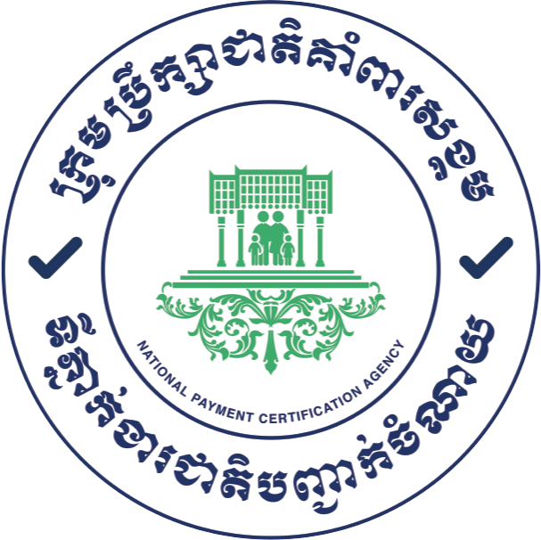

<p align="center">
    
</p>

# VAPT Nexus

A central place to manage vulnerability assessments (VAPT) run with Tenable Nessus. It pulls scan results
out of Nessus, groups them by project, tracks findings over time and produces numbered PDF reports.

Nessus runs inside an isolated VMware lab. The browser only talks to Laravel. Laravel is the only thing
that talks to Nessus. Use this system only against hosts you are authorized to test.

## Features

- **Projects**: each project has a short code (for example `POS`), members with a project role, and one or
  more Nessus servers. Members only see their own projects; admins see all of them.
- **Nessus servers**: register servers in the UI with their API keys (encrypted in the database) and check
  them with **Test Connection**.
- **Scan import**: import a scan that was run in the Nessus UI from a project page (**Import from Nessus**),
  or let the sync pick it up automatically (see [How scans get in](#how-scans-get-in)).
- **Scan results**: hosts, ports and findings per scan, with full plugin details (description, solution,
  CVEs, CVSS).
- **Findings**: one list of every finding across your projects, with filters for project, severity, state,
  host and text (name, CVE or plugin ID).
- **Dashboard**: severity totals and a trend chart of open findings over time.
- **PDF reports**: one report per Nessus run, numbered `VULN-{CODE}-{YEAR}-{00001}`. Generated
  automatically when a run finishes, or on demand.
- **Users**: admins create, edit and disable accounts. A disabled user can't sign in and is signed out if
  already logged in. Self-registration is turned off.
- **Audit log** of important actions, and a session-authenticated JSON API under `/api`.

### Nessus Essentials limitation

Nessus Essentials (the free licence) only allows **reading** through the API. Creating, launching and
exporting scans returns an error. So VAPT Nexus never starts scans. You run them in the Nessus UI, and
the app imports the results and builds its own PDF reports. A Nessus Professional or Expert licence would
remove this limit.

## Tech stack

- Laravel 13 (PHP 8.4), Fortify (login, 2FA, passkeys), dompdf for PDFs
- Vue 3 + Inertia 3 + TypeScript, Tailwind CSS 4, Vite+ (`vp`), Wayfinder
- MariaDB, and the database queue driver

## Requirements

- PHP 8.4 with `pdo_mysql` (Laravel Herd works on Windows)
- Composer, Node.js and npm
- MariaDB or MySQL
- A reachable Nessus server with an API access key and secret key

## Setup

```bash
# 1. Create an empty database and a user for it in MariaDB, e.g. "vapt_nexus".

# 2. Install dependencies, create .env, generate the app key, migrate and build the frontend.
composer run setup

# 3. Put the database credentials in .env (DB_DATABASE / DB_USERNAME / DB_PASSWORD),
#    then run the migrations again if step 2 could not reach the database.
php artisan migrate

# 4. Create the first admin account.
php artisan db:seed
```

`db:seed` creates `admin@vapt.local` (or `VAPT_ADMIN_EMAIL`). If `VAPT_ADMIN_PASSWORD` is empty, it
prints a random password **once**, so copy it and change it after you log in. The seeder also creates
four demo projects (`HC`, `SS`, `OCR`, `POS`). It is safe to run again: it never duplicates or overwrites
records, but it will recreate any demo project you deleted.

To create more users from the terminal instead of the UI:

```bash
php artisan vapt:user someone@example.com --name="Someone"          # member
php artisan vapt:user admin2@example.com --name="Second Admin" --admin
```

## Running

```bash
composer run dev
```

This starts everything the app needs together: the web server (http://127.0.0.1:8000), the queue worker
(imports and reports run as jobs), Vite, and the scheduler (Nessus sync and daily snapshots). If imports
or reports sit in "queued" forever, the queue worker isn't running.

Run only **one** `composer run dev` at a time. Extra copies leave stale servers on port 8000 and
duplicate workers.

## Configuration

Main `.env` keys besides the usual Laravel ones:

| Key                                   | Purpose                                                                                                        |
| ------------------------------------- | -------------------------------------------------------------------------------------------------------------- |
| `DB_CONNECTION=mariadb`, `DB_*`       | Database connection                                                                                            |
| `QUEUE_CONNECTION=database`           | Imports and PDF reports run on the queue                                                                       |
| `NESSUS_ALLOWED_NETWORKS`             | IPs/CIDRs a Nessus server URL may point to, e.g. `192.168.56.0/24,192.168.168.0/24`. Empty allows any address |
| `NESSUS_TIMEOUT`, `NESSUS_CONNECT_TIMEOUT` | Request timeouts to Nessus, in seconds                                                                    |
| `NESSUS_URL`, `NESSUS_ACCESS_KEY`, `NESSUS_SECRET_KEY`, `NESSUS_VERIFY_SSL` | Optional. Only used by `db:seed` to register a first server. Normally you add servers in the UI |
| `VAPT_ADMIN_EMAIL`, `VAPT_ADMIN_NAME`, `VAPT_ADMIN_PASSWORD` | Optional. The first admin account created by `db:seed`                            |

Nessus runs inside VMware, so a server URL is never `localhost`. Use the VM's address, for example
`https://192.168.168.129:8834` (NAT) or `https://192.168.56.10:8834` (host-only lab). Nessus uses a
self-signed certificate, so turn **Verify SSL** off for it unless you installed a trusted one.

## Roles

| Role                    | Can do                                                                            |
| ----------------------- | --------------------------------------------------------------------------------- |
| Admin (user role)       | Everything: Nessus servers, users, all projects, creating and deleting projects   |
| Member (user role)      | Only projects they are added to, with one of the project roles below              |
| Manager (project role)  | Edit the project, import and re-sync scans, generate and delete reports           |
| Analyst (project role)  | Import and re-sync scans, generate reports                                        |
| Viewer (project role)   | Read-only access to results and reports                                           |

Deleting a project is admin-only and requires typing the project code. It permanently removes the
project's scans, findings, assets and reports. The audit log entry is kept.

## How scans get in

1. Create a project and assign it a Nessus server.
2. Run the scan in the Nessus UI. **Put the project code in the scan name as a separate word**, for
   example `VA_POS` or `POS weekly` for project `POS`.
3. Every minute `nessus:sync` imports new scans whose name contains a project code, and re-imports scans
   whose run has finished. Each finished run gets its PDF report automatically.

You can also import any scan by hand from the project page with **Import from Nessus**.

Severity comes from each plugin's CVSS v3 rating, so the counts match what the Nessus UI shows.

Reports are stored privately in `storage/app/nessus/projects/{CODE}/reports/{YEAR}/` and are only
available through the app to users who can see the project. Deleting a report removes the PDF but keeps
its number, so numbers are never reused.

## Artisan commands

| Command                         | What it does                                                                      |
| ------------------------------- | --------------------------------------------------------------------------------- |
| `php artisan nessus:test [id]`  | Test the connection to one or all Nessus servers                                  |
| `php artisan nessus:sync`       | Import new scans named with a project code and re-import finished runs (every minute) |
| `php artisan findings:snapshot` | Record today's open findings per project for the trend chart (daily at 23:55)     |
| `php artisan vapt:user`         | Create a user account (`--admin` for an administrator)                            |

## Tests and code style

```bash
composer test          # Pint check, PHPStan, then the PHPUnit suite
php artisan test       # PHPUnit only
composer lint          # fix PHP style with Pint
npm run check:fix      # fix JS/Vue formatting and lint
npm run types:check    # vue-tsc
```

## Lab network

The VMware network (Windows host, Kali, Nessus and target VMs on an isolated host-only subnet) and its
setup and check scripts are documented in [`infra/lab/README.md`](infra/lab/README.md).

## Troubleshooting

| Symptom                                           | Check                                                                                                      |
| ------------------------------------------------- | ---------------------------------------------------------------------------------------------------------- |
| `could not find driver`                           | PHP's `pdo_mysql` extension isn't loaded. On Windows, Smart App Control can block it for Herd's PHP        |
| Test Connection fails                             | Nessus VM is running, the URL uses the VM's IP (not `localhost`), the IP is in `NESSUS_ALLOWED_NETWORKS`, `php artisan nessus:test` |
| Nessus says "not ready"                           | Nessus is still compiling plugins after an install or update. Wait and try again                           |
| Imports or reports stay queued                    | The queue worker isn't running. Start `composer run dev`                                                   |
| New scans never appear automatically              | The scan name must contain the project code as a whole word, and the scheduler must be running             |
| Old version of the app still shows on port 8000   | A stale `php artisan serve` from an earlier run is still holding the port. Stop it and start again         |
